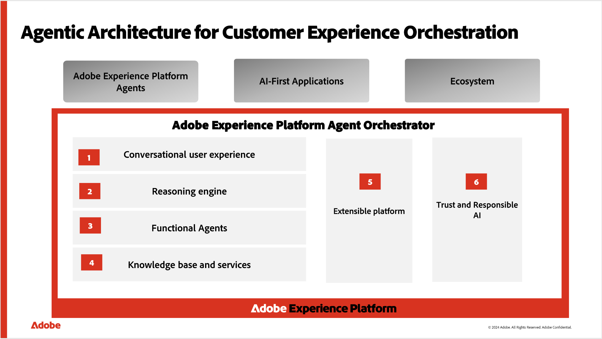

# Adobe Experience Platform Agent Orchestrator

Adobe Experience Platform Agent Orchestrator est la nouvelle couche agentique d’Adobe Experience Platform. Conçu pour exploiter les données riches et les connaissances des clients d’Experience Platform, Experience Platform Agent Orchestrator alimente l’intelligence et la raison derrière des agents Adobe Experience Platform experts spécialement conçus pour leur permettre d’exécuter des tâches complexes de prise de décision et de résolution de problèmes à grande vitesse et à grande échelle, le tout avec une supervision humaine. Lorsque vous posez des questions ou demandez de l’aide en langage naturel dans une interface conversationnelle telle que l’assistant IA, Agent Orchestrator fait automatiquement appel à des agentes et agents spécialisés pour vous fournir les bonnes réponses. Agent Orchestrator se souvient de l’historique de vos conversations, ce qui lui permet de s’appuyer naturellement sur vos questions précédentes sans répéter le contexte et de combiner les informations issues de plusieurs agentes et agents afin de vous présenter des réponses claires et unifiées.

Vous pouvez effectuer des workflows complexes de bout en bout par le biais d’une interface conversationnelle intuitive sans avoir à connaître les agents qui travaillent en arrière-plan. Le système comprend vos objectifs, crée des plans détaillés et ajuste son approche selon vos besoins en fonction de vos commentaires. Au cours de votre conversation dans l’assistant d’IA, vous pouvez explorer le panneau de raisonnement d’Agent Orchestrator pour voir le processus de réflexion étape par étape et mieux comprendre comment vos requêtes sont traitées.

>[!SLIDE](agent-orchestrator-overview)

Lisez ce document pour en savoir plus sur Agent Orchestrator.

## Composants d’Agent Orchestrator {#components}

Agent Orchestrator est constitué de plusieurs composants essentiels, notamment l’interface conversationnelle de l’assistant d’IA, un moteur de raisonnement pour la prise de décision et la planification, des agents Adobe Experience Platform spécialisés et une base de connaissances qui permet d’accéder aux informations pertinentes.

### Interface conversationnelle de l’Assistant IA {#ai-assistant}

L’assistant AI est une expérience de conversation intelligente en langage naturel qui permet aux utilisateurs d’applications d’entreprise CX activées d’exploiter les fonctionnalités de GenAI et d’IA agentique, dont l’ampleur dépend des applications d’entreprise CX sous licence des clients. Pour déverrouiller l’accès, lisez [le guide sur l’accès à l’assistant AI](https://experienceleague.adobe.com/en/docs/experience-platform/ai-assistant/access).

Pour plus d’informations, consultez le [guide de l’interface d’utilisation de l’Assistant IA](../ai-assistant/ai-assistant-ui.md).

### Moteur de raisonnement {#reasoning-engine}

Le moteur de raisonnement interprète vos objectifs en fonction des invites du langage naturel, vérifie les limites ou les exigences et crée des plans détaillés pour vous aider à atteindre vos objectifs. Contrairement aux systèmes simples de questions-réponses, il peut ajuster ses plans à mesure que les choses changent et peut revenir en arrière et essayer différentes approches si nécessaire. Les plans qu’il crée vous sont présentés dans l’interface conversationnelle de l’assistant d’IA. Vous pouvez ainsi voir et suivre le processus, ainsi qu’intervenir si nécessaire.

### Agents Adobe Experience Platform {#agents}

Les agents Adobe Experience Platform sont un groupe d’agents d’IA dédiés, qualifiés pour fournir des tâches courantes dans les domaines de l’expérience client. Vous trouverez ci-dessous la liste des agents Adobe Experience Platform actuellement disponibles dans les applications CX Enterprise :

| Agent | Détails | Applications prises en charge |
| --- | --- | --- |
| [&#128279;](audience.md) | Audience Agent vous permet d’obtenir des informations sur les audiences, notamment la détection des modifications importantes de la taille de l’audience, la détection des audiences en double, l’exploration de l’inventaire de vos audiences et la récupération de la taille de vos audiences. | <ul><li>Real-Time CDP</li><li>Adobe Journey Optimizer</li></ul> |
| [&#128279;](https://experienceleague.adobe.com/fr/docs/analytics-platform/using/cja-overview/cja-b2c-overview/data-analysis-ai) | Data Insights Agent, accessible à partir de l’assistant d’IA dans Customer Journey Analytics, est un agent de conversation d’IA génératif qui répond rapidement et efficacement aux questions sur vos données. Il crée des visualisations pertinentes dans Analysis Workspace en utilisant les composants de votre vue de données et vos données réelles. | Customer Journey Analytics |
| [&#128279;](./agent-experiment.md) | Experimentation Agent permet aux équipes d’apprendre plus rapidement en analysant les résultats des expériences, en prédisant l’impact et en proposant de nouvelles expériences. Il centralise les expériences passées et actives afin que vous puissiez tirer parti de ce que vous avez déjà appris, repérer les lacunes et prioriser les prochaines étapes à tester. | Adobe Journey Optimizer Experimentation Accelerator |
| [&#128279;](./ajo-agent.md) | Journey Agent permet aux utilisateurs de Adobe Journey Optimizer de créer, d’analyser et d’optimiser des parcours à l’aide du langage naturel, grâce à quatre fonctionnalités : [Création de Parcours &#x200B;](./ajo-agent.md#journey-create), [Création de contenu de canal](./ajo-agent.md#channel-content-create), [Analyse de Parcours &#x200B;](./ajo-agent.md#journey-analyze) et [Simulation de Parcours &#x200B;](./ajo-agent.md#journey-simulate). Voir le guide [&#128279;](./ajo-agent.md) pour plus de détails. | Adobe Journey Optimizer |
| [Agent du support produit](product-support.md) | L’agent de support produit est une fonctionnalité de débogage et de dépannage en libre-service qui vous permet de résoudre les problèmes liés aux fonctionnalités et applications Adobe Experience Platform sans quitter vos workflows. Les administrateurs de l’assistance peuvent créer des tickets d’assistance clientèle avec du contexte à partir de vos interactions avec l’assistant AI et vous pouvez vérifier les mises à jour des tickets via l’assistant AI. | <ul><li>Adobe Experience Platform</li><li>Real-Time CDP</li><li>Adobe Journey Optimizer</li><li>Adobe Journey Optimizer B2B edition</li><li>Customer Journey Analytics</li><li>Adobe Experience Manager</li></ul> |

Pour plus d’informations sur la disponibilité des agents dans les applications d’entreprise CX, consultez la [documentation sur l’IA dédiée aux agents dans l’entreprise CX](../overview/agentic-ai.md).

### Base de connaissances {#knowledge-base}

La base de connaissances fournit aux agents un accès sécurisé à l’intelligence commerciale des clients par le biais de sources de données structurées et non structurées, notamment la documentation du produit Adobe, les métadonnées du client sur les objets commerciaux et les données d’analyse.

## Écosystème {#ecosystem}

L’écosystème Agent Orchestrator comprend les agents suivants :

| Agent | Détails |
| --- | --- |
| [Adobe Marketing Agent pour Microsoft 365 Copilot](ama-ms.md) | Utilisez Adobe Marketing Agent for [!DNL Microsoft 365 Copilot] pour récupérer des informations marketing à partir d’Experience Platform dans des applications [!DNL Microsoft 365] telles que [!DNL Teams], [!DNL Word], [!DNL Powerpoint] et [!DNL Excel]. Avec cet agent, vous pouvez : <ul><li>Prenez plus rapidement des décisions de marketing axées sur les données.</li><li>Réduisez le temps nécessaire pour passer d’un outil à un autre.</li><li>Simplifiez l’accès aux informations sur les audiences et les parcours entre les équipes.</li></ul> |

## Accès {#access}

Tous les utilisateurs ont accès à l’assistant AI et aux agents Experience Platform associés.

* **Adobe Experience Manager** : votre administrateur doit vous accorder l’autorisation d’accéder à l’assistant AI via [Adobe Admin Console](https://helpx.adobe.com/fr/enterprise/using/admin-console.html).

* **Customer Journey Analytics** : votre administrateur doit vous accorder l’autorisation d’accéder à l’assistant AI par le biais du contrôle d’accès de [Customer Journey Analytics](https://experienceleague.adobe.com/fr/docs/analytics-platform/using/technotes/access-control). Cela vous permet de poser des questions sur la connaissance des produits et les informations sur les données.

>[!NOTE]
>
>Les questions d’informations opérationnelles ne sont pas disponibles pour Customer Journey Analytics. Par conséquent, aucune autorisation supplémentaire ne s’applique.
