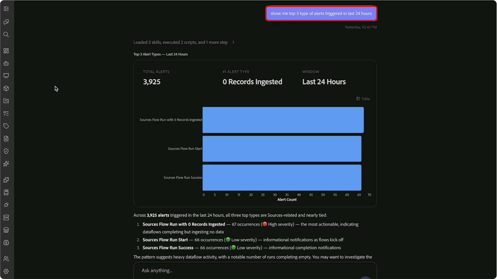

# Compétences en alertes client

>[!AVAILABILITY]
>
> Les compétences en alertes clients sont disponibles pour tous les clients ayant accès à Adobe CX Enterprise Coworker.
>
> Pour utiliser les compétences en matière d’alertes clients, vous devez avoir accès aux alertes Adobe Experience Platform et aux ressources associées à ces alertes.

Utilisez les compétences en alerte client de CX Coworker pour transformer l’activité d’alerte en un briefing opérationnel personnalisé. Passez en revue les alertes récentes, identifiez les problèmes hautement prioritaires, comprenez quelles ressources sont affectées et concentrez les efforts d&#39;enquête grâce à des conversations en langage naturel.

Les compétences en alertes clients vous permettent de passer des signaux d’alerte aux informations exploitables sans passer manuellement en revue les vues d’alerte ou mettre en corrélation les informations sur plusieurs interfaces. Commencez par une question générale sur l’activité d’alerte récente, puis utilisez les questions de suivi pour identifier les modèles d’alerte récurrents, analyser les objets affectés et vous concentrer sur les alertes que vous possédez.

Pour plus d’informations sur les alertes client, consultez la [présentation des alertes client](https://experienceleague.adobe.com/fr/docs/experience-platform/observability/alerts/overview).

## Conditions préalables {#prerequisites}

Avant de commencer, vérifiez que vous disposez des éléments suivants :

- Accès à Adobe Experience Platform.
- Autorisation d’afficher les alertes pertinentes pour votre organisation.
- Plug-in CXO Adobe installé dans CX Coworker.

Pour obtenir des instructions sur l’installation de modules externes, voir https://experienceleague.adobe.com/en/docs/cx-enterprise-coworker/content/chat/ui-guide.

## Utilisation des compétences en alertes client {#use-customer-alert-skills}

Interagissez avec les compétences en alerte client via un collègue CX à l’aide de requêtes en langage naturel. Posez des questions sur l’activité d’alerte, les abonnements, les tendances d’alerte ou les objets affectés. Poursuivez la conversation avec des questions de suivi pour affiner les résultats et concentrer votre analyse.

Pour utiliser les compétences en matière d’alertes client :

1. Accédez à **[!UICONTROL Collègue CX]**.

1. Saisissez une question ou une demande concernant vos alertes. Par exemple :

   *« Répertorier toutes les alertes déclenchées au cours des dernières 24 heures ?«*

   

1. Examinez les résultats renvoyés par la section Compétences en alertes client.

   

1. Affinez les résultats avec des questions de suivi. Par exemple :

   *« Affichez-moi les 3 principaux types d’alertes déclenchées au cours des dernières 24 heures.«*

   

1. Continuez à réduire la portée jusqu’à ce que vous identifiiez les alertes, les modèles ou les objets concernés qui nécessitent une attention particulière. Par exemple :

   *« Répertoriez les 5 principaux objets concernés par les alertes de gravité élevée »*

   

Les compétences en alerte client conservent un contexte conversationnel, ce qui vous permet de passer de l’activité d’alerte à l’enquête ciblée sans répéter les requêtes précédentes.

## Cas d’utilisation pris en charge {#supported-use-cases}

Utilisez les compétences en alertes clients pour surveiller l’activité opérationnelle, enquêter sur les problèmes et vous concentrer sur les alertes les plus pertinentes pour votre rôle.

### Vérifier l’activité d’alerte

Vérifiez l’état d’alerte actuel ou l’activité d’alerte historique au cours d’une période spécifique.

Par exemple :

- « Quelles alertes ont été déclenchées au cours des dernières 24 heures ? »
- « Afficher les alertes actives des sept derniers jours. »

### Identification des modèles d’alerte récurrents

Consultez l’historique des alertes pour identifier les types d’alertes qui se produisent le plus souvent dans votre organisation. Au lieu d’examiner un grand nombre d’événements d’alerte individuels, utilisez les compétences en alertes client pour résumer les schémas récurrents et mettre en évidence les domaines qui peuvent nécessiter une attention particulière.

Par exemple :

- « Affichez-moi les 3 principaux types d’alerte déclenchés. »
- « Quels types d’alerte se sont produits le plus fréquemment ce mois-ci ? »

### Se concentrer sur les questions hautement prioritaires

Limitez les résultats à un niveau de gravité spécifique pour donner la priorité aux efforts d’enquête.

Par exemple :

- « Afficher uniquement les alertes de gravité élevée. »
- « Quelles alertes critiques ont été déclenchées cette semaine ? »

### Comprendre le rayon d’impact des alertes

Identifiez les objets les plus fréquemment affectés et comprenez où l&#39;investigation doit commencer.

Les compétences en alertes clients analysent l’activité des alertes et font apparaître les objets associés aux alertes récurrentes ou de gravité élevée, ce qui vous permet de vous concentrer sur les domaines ayant l’impact opérationnel le plus important.

Par exemple :

- « Quels sont les 5 objets les plus impactés ? »
- « Quels objets sont associés aux alertes de niveau de gravité le plus élevé ? »

### Connecter les types d’alerte aux objets concernés

comprendre l’impact de l’activité d’alerte sur des ressources spécifiques ;

Les compétences en alertes clients permettent de connecter les objets concernés aux types d’alertes qui les ont déclenchés, ce qui vous aide à identifier les modèles et à déterminer la source probable des problèmes opérationnels.

Par exemple :

- « Quels types d’alerte ont le plus souvent eu un impact sur ce jeu de données ? »
- « Afficher la relation entre les types d’alerte et les objets concernés. »
- « Quel type d’alerte a le plus fréquemment affecté l’objet le plus affecté ? »

### Concentrez-vous sur mes alertes

Analysez les alertes auxquelles vous vous abonnez et qui sont chargées de la surveillance.

Utilisez l’expérience [!DNL My Alerts] pour passer en revue les activités récentes, hiérarchiser les problèmes de gravité élevée et concentrer l’analyse opérationnelle sur les alertes les plus pertinentes pour votre rôle.

Par exemple :

- « Afficher les alertes de gravité élevée auxquelles je m’abonne. »
- « Quelles alertes de [!DNL My Alerts] ont été déclenchées cette semaine ? »
- « Est-ce que l’une des alertes auxquelles je suis abonné nécessite une attention particulière ? »

### Gestion des abonnements aux alertes

Consultez et gérez les abonnements aux alertes par le biais de conversations en langage naturel.

Par exemple :

- « À quelles alertes suis-je abonné ? »
- « Abonne-moi à cette alerte. »
- « Supprimer mon abonnement à cette alerte. »

## Exemples d’invites {#example-prompts}

Utilisez les invites suivantes comme exemples lors de l&#39;interaction avec les compétences en alertes client.

### Invites d’activité d’alerte

- « Que s&#39;est-il passé au cours des dernières 24 heures ? »
- « Quelles alertes ont été déclenchées au cours des dernières 24 heures ? »
- « Afficher toutes les alertes déclenchées cette semaine. »
- « Est-ce que j’ai des alertes actives ? »

### Invites de tendance d’alerte

- « Affichez-moi les 3 principaux types d’alerte déclenchés. »
- « Quels types d’alerte se sont produits le plus fréquemment ce mois-ci ? »
- « Quels modèles d’alerte voyez-vous au cours des sept derniers jours ? »

### Invites d’analyse de gravité

- « Afficher uniquement les alertes de gravité élevée. »
- « Afficher les alertes critiques des 30 derniers jours. »
- « Quelles sont les alertes de gravité élevée les plus fréquentes ? »

### Invites d’analyse d’impact

- « Quels sont les 5 objets les plus impactés ? »
- « Quels objets sont associés au plus grand nombre d’alertes ? »
- « Afficher la relation entre les types d’alerte et les objets concernés. »
- « Quel type d’alerte a le plus fréquemment affecté l’objet le plus affecté ? »

### Invites Mes alertes

- « Afficher les alertes de gravité élevée auxquelles je m’abonne. »
- « Quelles alertes de [!DNL My Alerts] ont été déclenchées cette semaine ? »
- « Certaines des alertes auxquelles je suis abonné sont-elles actives actuellement ? »
- « Est-ce que l’une des alertes auxquelles je suis abonné nécessite une attention particulière ? »

### Invites de gestion des abonnements

- « À quelles alertes suis-je abonné ? »
- « Abonne-moi à cette alerte. »
- « Supprimer mon abonnement à cette alerte. »

## Étapes suivantes {#next-steps}

Après avoir lu ce guide, vous devriez comprendre comment utiliser les compétences en alertes client dans CX Coworker pour examiner l’activité des alertes, analyser les tendances des alertes, gérer les abonnements aux alertes et enquêter sur les problèmes opérationnels par le biais de conversations en langage naturel.

Pour plus d’informations sur les alertes, consultez la [présentation des alertes client](https://experienceleague.adobe.com/fr/docs/experience-platform/observability/alerts/overview).
