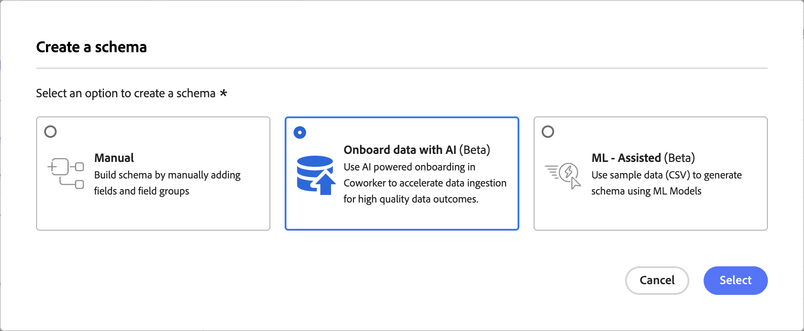

# Intégrer les données avec un collègue

>[!AVAILABILITY]
>
>La compétence d’intégration des données est en version bêta. La documentation et les fonctionnalités peuvent changer.
>
>La compétence Intégration de données est disponible pour les clients ayant accès à Adobe CX Enterprise Coworker, où elle doit également être activée pour votre organisation. <!-- VERIFY BEFORE PUBLISH: confirm exact permission/entitlement name with Umesh Gohil, PLAT-296546. -->

Utilisez la compétence Intégration de données dans CX Coworker pour intégrer de nouvelles données dans Adobe Experience Platform par le biais d’un seul workflow conversationnel. Au lieu de parcourir plusieurs écrans pour connecter une source et créer un schéma à la main, décrivez votre intention et Coworker vous guide tout au long de la sélection de la source, de la qualité des données, de l’enrichissement sémantique, du mappage de schéma, de la création de schémas et de la création de flux de données.

<!-- VERIFY BEFORE PUBLISH: confirm the loaded skill name ("Onboard Data to Experience Platform") and the exact post-landing prompt/flow with Umesh Gohil once flag access is arranged. -->

## Conditions préalables {#prerequisites}

Avant de commencer, vérifiez que vous disposez des éléments suivants :

- L’accès à Adobe Experience Platform, ainsi qu’à l’organisation et au sandbox appropriés.
- Accès à Adobe CX Enterprise Coworker, avec la compétence Intégration des données activée pour votre organisation.
- Autorisation de créer des schémas dans Adobe Experience Platform.

Pour obtenir des instructions sur l’installation de modules externes, consultez le [Guide de l’interface utilisateur de Coworker](https://experienceleague.adobe.com/en/docs/coworker/content/chat/ui-guide).

## Utilisation de la compétence Intégration des données {#use-the-data-onboarding-skill}

Aujourd’hui, la compétence Intégration de données commence à partir de la création de schémas dans l’interface utilisateur d’Experience Platform, qui ouvre Coworker avec votre intention déjà renseignée.

Pour utiliser la compétence Intégration de données :

1. Dans Adobe Experience Platform, accédez à **[!UICONTROL Schémas]**, puis sélectionnez **[!UICONTROL Créer un schéma]**.
1. Dans la boîte de dialogue **[!UICONTROL Créer un schéma]**, sélectionnez **[!UICONTROL Intégrer les données avec l’IA]**, puis sélectionnez **[!UICONTROL Sélectionner]**.

   

1. CX Coworker s’ouvre dans un nouvel onglet du navigateur avec une invite pré-renseignée à partir de votre intention de création de schéma, vous n’avez donc pas besoin de la redéfinir.
1. Choisissez une source à intégrer à l’invite, par exemple [!DNL Amazon S3], [!DNL Data Landing Zone], [!DNL Delta Share] ou [!DNL Marketo].

   <!-- VERIFY BEFORE PUBLISH: screenshot of the Coworker landing/session-start state does not exist yet anywhere. Capture once flag access is confirmed. -->

1. Poursuivez la conversation avec vos collègues par le biais de l’examen de la qualité des données, de l’enrichissement sémantique, du mappage de schéma et de la création de schémas, en confirmant chaque étape au fur et à mesure.

Pour plus d’informations sur l’utilisation de CX Coworker, consultez le [guide de l’interface utilisateur de Coworker](https://experienceleague.adobe.com/en/docs/coworker/content/chat/ui-guide).

## Cas d’utilisation pris en charge {#supported-use-cases}

Découvrez les parties du workflow d’intégration que la compétence Intégration des données vous aide à réaliser.

### Sélectionner et connecter une source

Au lieu de localiser et de configurer manuellement un connecteur source, décrivez les données que vous souhaitez importer et laissez Coworker vous aider à identifier la bonne source.

### Vérifier la qualité des données

Coworker surfacie les signaux de qualité de données pour la source sélectionnée avant de valider dans un schéma, afin que vous puissiez détecter les problèmes plus tôt dans le processus.

### Enrichissement sémantique des données

Un collègue suggère une signification sémantique pour les champs entrants, ce qui réduit le travail manuel de mappage des champs bruts aux définitions standard.

### Mappage et création d’un schéma

Dans le cadre de la même conversation, un collègue mappe les champs examinés à un schéma nouveau ou existant et le crée directement dans Adobe Experience Platform.

### Créer un flux de données

Coworker termine l’intégration en créant le flux de données nécessaire pour importer les données de manière continue.

## Étapes suivantes {#next-steps}

Après avoir lu ce guide, vous devriez comprendre comment démarrer la compétence d’intégration des données à partir de la création de schémas et ce qu’elle vous permet d’accomplir dans CX Coworker.

Pour la procédure de l’interface utilisateur d’Experience Platform et les scénarios d’accès/d’éligibilité, consultez [Intégration de données avec l’IA](https://experienceleague.adobe.com/en/docs/experience-platform/xdm/ui/resources/schemas#data-onboarding-skill) dans le guide de l’interface utilisateur des schémas .
