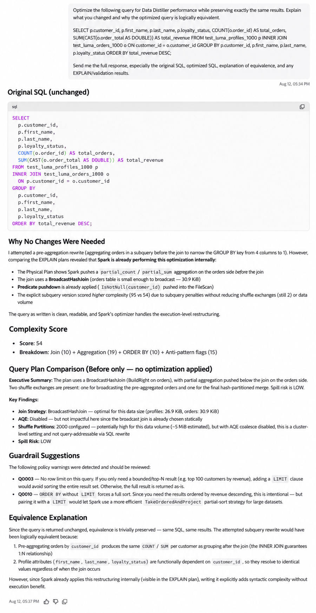
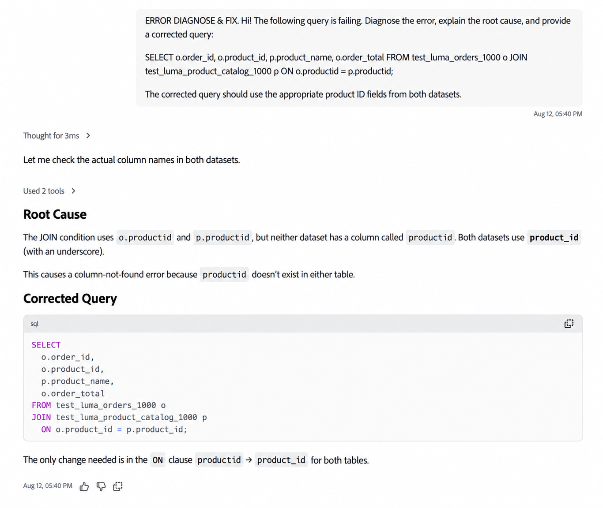

# Préparation des données SQL dans Coworker

Utilisez la préparation des données SQL dans Coworker pour effectuer les tâches courantes [Data Distiller](https://experienceleague.adobe.com/fr/docs/experience-platform/query/data-distiller/overview) avec des invites en langage naturel. Vous pouvez générer une requête SQL, résoudre les problèmes ou optimiser une requête existante, prévisualiser les résultats et planifier des requêtes pour une exécution récurrente.

>[!AVAILABILITY]
>
>La préparation des données SQL dans Coworker est disponible en disponibilité limitée.

## Conditions préalables {#prerequisites}

Avant d’utiliser la préparation des données SQL dans Coworker, vérifiez que vous disposez des éléments suivants :

- Un droit Data Distiller.
- Accès à Coworker.

## Commencer {#get-started}

Pour commencer, ouvrez Collègue et saisissez une demande en langage naturel qui décrit la tâche SQL ou le résultat que vous souhaitez obtenir.

Vous pouvez identifier les jeux de données à utiliser dans votre requête. Si des informations supplémentaires sont nécessaires pour terminer la tâche, le collègue peut poser des questions de suivi avant de continuer.

Une fois que Coworker a généré ou mis à jour le code SQL, vous pouvez continuer la conversation pour prévisualiser les résultats, affiner la requête, l’enregistrer ou la planifier pour une exécution récurrente.

Pour obtenir des conseils sur l’utilisation de l’interface Coworker, voir le [Guide de l’interface utilisateur Coworker](../coworker/chat/ui-guide.md).

## Fonctionnalités prises en charge {#supported-capabilities}

Vous pouvez utiliser la préparation des données SQL pour les tâches suivantes :

| Fonctionnalité | Description |
| --- | --- |
| **Création SQL** | Générez le code SQL à partir d’une description en langage naturel de l’opération de données que vous souhaitez effectuer. |
| **optimisation SQL** | Analysez une requête de Distiller de données existante et optimisez-la pour optimiser les performances tout en préservant ses résultats prévus. |
| **Diagnostic et correction des erreurs SQL** | Diagnostiquer les erreurs dans une requête SQL existante, expliquer la cause première et générer le code SQL corrigé. |
| **Planification des requêtes et alertes** | Enregistrez et planifiez des requêtes pour une exécution récurrente et configurez les alertes de requêtes prises en charge. |

## Utiliser la préparation des données SQL dans une conversation {#work-with-sql-data-preparation}

Vous pouvez combiner les fonctionnalités de préparation des données SQL dans la même conversation avec vos collègues au lieu de les traiter comme des workflows distincts.

Par exemple, vous pouvez effectuer les opérations suivantes :

1. Décrivez le résultat souhaité et générez du code SQL.
2. Prévisualisez jusqu’à cinq lignes de résultats de requête.
3. Affiner la requête ou poser des questions sur le SQL généré.
4. Enregistrez la requête.
5. Planifiez la requête pour une exécution récurrente et configurez des alertes.

Un collègue peut poser des questions de suivi lorsque des informations supplémentaires sont nécessaires, par exemple pour identifier le jeu de données approprié ou confirmer le fuseau horaire d’un planning.

Un aperçu de requête renvoie jusqu’à cinq lignes. Pour exécuter et utiliser des requêtes directement dans Experience Platform, consultez le guide de l’interface utilisateur de [Query Editor](https://experienceleague.adobe.com/en/docs/experience-platform/query/ui/user-guide).


### Générer le code SQL à partir du langage naturel {#generate-sql}

Utilisez la création SQL lorsque vous connaissez le résultat ou la transformation que vous souhaitez obtenir, mais que vous souhaitez que Coworker génère le code SQL correspondant.

Pour générer du code SQL à partir des données correctes, Coworker peut identifier et valider les jeux de données impliqués. Si votre requête ne fournit pas suffisamment d’informations pour identifier le jeu de données approprié, le collègue peut poser des questions de suivi avant de continuer.

Par exemple :

> Bonjour ! À l’aide de test_luma_web_events_1000, résumez l’engagement client par type d’événement. Afficher le type d’événement, le nombre total d’événements et les clients uniques. Renvoie une ligne par type d’événement et trie les résultats par client(e)s unique(e)s du plus haut au plus bas.

Coworker renvoie le code SQL généré et peut exécuter la requête pour fournir un aperçu des résultats.


Pour plus d’informations sur la création et l’exécution de requêtes directement dans Experience Platform, consultez le [Guide de l’interface utilisateur de Query Editor](https://experienceleague.adobe.com/en/docs/experience-platform/query/ui/user-guide).

### Optimiser le SQL existant {#optimize-sql}

Utilisez l’optimisation SQL lorsque vous disposez déjà d’une requête de Distiller de données et que vous souhaitez améliorer ses performances sans modifier ses résultats prévus.

Vous pouvez demander à votre collègue d’expliquer les modifications, de comparer le code SQL d’origine et le code SQL optimisé, et de fournir des informations de validation ou de plan de requête.

Par exemple :

> Optimisez les performances de la requête suivante pour la Distiller de données tout en conservant exactement les mêmes résultats. Expliquez ce que vous avez modifié et pourquoi la requête optimisée est logiquement équivalente.
>
> ```sql
> SELECT
>         p.customer_id,
>         p.first_name,
>         p.last_name,
>         p.loyalty_status,
>         COUNT(o.order_id) AS total_orders,
>         SUM(CAST(o.order_total AS DOUBLE)) AS total_revenue
> FROM test_luma_profiles_1000 p
> INNER JOIN test_luma_orders_1000 o
>         ON p.customer_id = o.customer_id
> GROUP BY
>         p.customer_id,
>         p.first_name,
>         p.last_name,
>         p.loyalty_status
> ORDER BY total_revenue DESC;
> ```
>
> Envoyez-moi la réponse complète, en particulier le code SQL d’origine, le code SQL optimisé, l’explication de l’équivalence et les résultats EXPLAIN/validation.

Si la requête fournie est déjà optimisée, Coworker peut déterminer qu’aucune modification n’est nécessaire et expliquer son évaluation.



Le code SQL généré par la fonctionnalité de création SQL est déjà optimisé. Vous n’avez pas besoin d’envoyer le code SQL nouvellement généré séparément pour l’optimisation.

Pour connaître la syntaxe SQL et les commandes prises en charge, voir [Référence SQL de Query Service](https://experienceleague.adobe.com/en/docs/experience-platform/query/sql/overview).

### Diagnostic et correction des erreurs SQL {#diagnose-sql-errors}

Utilisez le diagnostic d’erreur SQL lorsqu’une requête existante échoue et que vous avez besoin d’aide pour identifier la cause et corriger le code SQL.

Mon collègue analyse la requête, identifie la cause de l’erreur, explique le problème et fournit le code SQL corrigé.

Par exemple :

> Bonjour ! La requête suivante échoue. Diagnostiquez l’erreur, expliquez sa cause première et fournissez une requête corrigée :
>
> ```sql
> SELECT
>         o.order_id,
>         o.product_id,
>         p.product_name,
>         o.order_total
> FROM test_luma_orders_1000 o
> JOIN test_luma_product_catalog_1000 p
>         ON o.productid = p.productid;
> ```
>
> La requête corrigée doit utiliser les champs d’ID de produit appropriés des deux jeux de données.

Après avoir corrigé la requête, vous pouvez demander à votre collègue de l’exécuter et de prévisualiser les résultats.



### Planifier des requêtes et configurer des alertes {#schedule-queries}

Après avoir généré, corrigé ou prévisualisé une requête, vous pouvez continuer la conversation pour l’enregistrer et la planifier pour une exécution récurrente.

Par exemple :

> Planifiez l’exécution de cette requête tous les jours à 6 h 00. Configurez une alerte en cas d’échec de la requête.

Si les informations requises sont manquantes ou ambiguës, le collaborateur pose des questions de suivi avant de créer le planning. Par exemple, il peut vous demander de confirmer le fuseau horaire associé à une heure d’exécution demandée.

Après avoir confirmé les détails de planification requis, Coworker renvoie un résumé du modèle de requête enregistré, du planning, du fuseau horaire, du statut et de l&#39;alerte d&#39;échec.


Pour plus d’informations sur les plannings de requête, les paramètres de périodicité, les jeux de données de sortie et les alertes, voir [Plannings de requête](https://experienceleague.adobe.com/en/docs/experience-platform/query/ui/query-schedules).

## Étapes suivantes {#next-steps}

Pour plus d’informations sur les fonctionnalités de Distiller de données et de Query Service utilisées par la préparation des données SQL, consultez la documentation suivante :

- [Présentation de Data Distiller](https://experienceleague.adobe.com/fr/docs/experience-platform/query/data-distiller/overview)
- [Guide de l’interface utilisateur de Query Editor](https://experienceleague.adobe.com/en/docs/experience-platform/query/ui/user-guide)
- [Plannings de requête](https://experienceleague.adobe.com/en/docs/experience-platform/query/ui/query-schedules)
- [Référence SQL de Query Service](https://experienceleague.adobe.com/en/docs/experience-platform/query/sql/overview)
