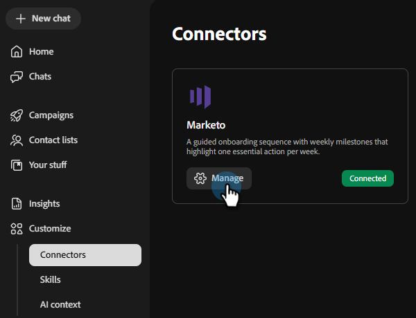

# Connexion à Marketo Engage {#marketo}

Les campagnes Adobe Coworker vous permettent de connecter votre compte Marketo Engage pour extraire des listes dynamiques et statiques.

>[!PREREQUISITES]
>
>Pour utiliser ce connecteur, vous devez d’abord disposer des éléments suivants :
>
>* Un compte Marketo Engage actif
>* Votre Marketo **URL d’instance**
>* Un [service personnalisé](https://experienceleague.adobe.com/fr/docs/marketo-developer/marketo/rest/custom-services#custom-services-1) créé pour les campagnes de collègues dans Marketo, avec son [identifiant client et secret client](https://experienceleague.adobe.com/fr/docs/marketo-developer/marketo/rest/authentication#creating-an-access-token) disponible

## Comment se connecter

1. Sur la [page d’accueil des campagnes de collègues](https://coworker-campaigns.experience.adobe.com/), cliquez sur **Personnaliser** et sélectionnez **Connecteurs**.

   

1. Cliquez sur **Ajouter une intégration**.

   

   >[!NOTE]
   >
   >S’il ne s’agit pas de votre première intégration, le bouton indique « Ajouter un connecteur ».

1. Dans la ligne Marketo, cliquez sur **Connexion**.

   

1. Saisissez votre Marketo **URL de l’instance**, **ID client** et **Secret client**. Cliquez sur **Connecter**.

   >[!NOTE]
   >
   >Vous trouverez l’URL de votre instance Marketo dans la barre d’adresse de votre navigateur lors de l’affichage de votre page My Marketo.

   

Après la connexion, Marketo apparaît dans la liste Connecteurs et peut être sélectionné lors de la liaison d’une liste de contacts à synchroniser à partir de Marketo.

**Pour vous déconnecter :**

1. Dans l’écran Connecteurs, recherchez la mosaïque Marketo et cliquez sur **Gérer**.

   

1. Cliquez sur **Déconnecter** (il n’est pas nécessaire de saisir à nouveau votre secret client pour le moment).

   

   >[!NOTE]
   >
   >Une fois l’URL d’instance ajoutée pour la première fois, elle est définie par défaut sur l’URL du point d’entrée REST, se terminant par `*.mktorest.com`.

1. Cliquez de nouveau sur **Déconnecter** pour confirmer.

   
