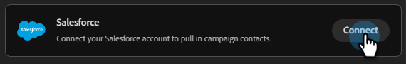
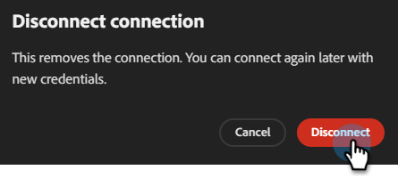

# Connexion à Salesforce {#salesforce}

Les campagnes Adobe Coworker vous permettent de connecter votre compte Salesforce pour accéder à vos prospects et contacts.

>[!PREREQUISITES]
>
>Pour utiliser ce connecteur, vous devez d’abord disposer des éléments suivants :
>
>* Un compte Salesforce actif
>* Les autorisations suivantes dans Salesforce : `api`, `sobjects.Contact.read`, `sobjects.Campaign.read`, `sobjects.CampaignMember.read`
>* L’URL de votre instance Salesforce, l’[ID client et le secret client](https://help.salesforce.com/s/articleView?id=xcloud.remoteaccess_oauth_client_credentials_flow.htm&type=5#:~:text=DESCRIPTION-,client_id,-The%20consumer%20key) sont pratiques

## Comment se connecter

1. Sur la [page d’accueil des campagnes de collègues](https://coworker-campaigns.experience.adobe.com/), cliquez sur **Personnaliser** et sélectionnez **Connecteurs**.

   

1. Cliquez sur **Ajouter une intégration**.

   

   >[!NOTE]
   >
   >S’il ne s’agit pas de votre première intégration, le bouton indique « Ajouter un connecteur ».

1. Dans la ligne Salesforce, cliquez sur **Connexion**.

   

1. Saisissez votre Salesforce **URL de l’instance**, **ID client** et **Secret client**. Cliquez sur **Connecter**.

   >[!NOTE]
   >
   >* Dans Salesforce, ID client = Consumer Key et Secret client = Consumer Secret.
   >
   >* Depuis votre compte Salesforce, vous pouvez trouver l’URL de votre instance dans la barre d’adresse de votre navigateur ou en accédant à **Configuration** > **Paramètres de la société** > **Mon domaine**.

   

Après la connexion, Salesforce apparaît dans la liste Connecteurs et peut être sélectionné lors de la liaison d’un prospect ou d’une liste de contacts à synchroniser à partir de Salesforce.

**Pour vous déconnecter :**

1. Dans l’écran Connecteurs, recherchez la mosaïque Salesforce et cliquez sur **Gérer**.

   

1. Cliquez sur **Déconnecter** (il n’est pas nécessaire de saisir à nouveau votre secret client pour le moment).

   

1. Cliquez de nouveau sur **Déconnecter** pour confirmer.

   
