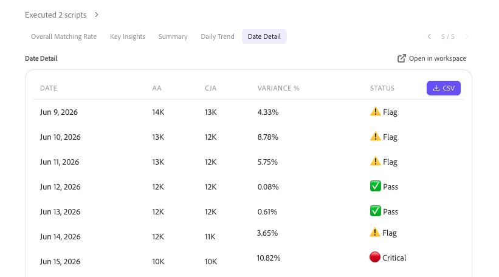

# Valider les données avec un collègue lors de la mise à niveau d’Adobe Analytics vers Customer Journey Analytics

>[!NOTE]
> 
>Suivez les étapes de cette page uniquement après avoir effectué toutes les étapes de mise à niveau précédentes. Vous pouvez suivre les étapes de mise à niveau recommandées (recommandées pour la plupart des organisations) ou suivre les étapes générées dynamiquement pour votre organisation à l’aide du Guide de mise à niveau de Customer Journey Analytics. <ul><li>**Étapes de mise à niveau recommandées** (recommandée pour la plupart des entreprises)
Un ensemble d’étapes qui conduisent à une implémentation Customer Journey Analytics idéale.

Pour plus d’informations, voir [ Mise à niveau d’Adobe Analytics vers Customer Journey Analytics ](https://experienceleague.adobe.com/en/docs/analytics-platform/using/compare-aa-cja/upgrade-to-cja/cja-upgrade-recommendations).
</li><li>**Guide de mise à niveau de Customer Journey Analytics** (étapes personnalisées adaptées aux besoins spécifiques de votre entreprise)
Un nouveau guide de mise à niveau est disponible pour générer dynamiquement des étapes de mise à niveau adaptées à votre entreprise et à vos circonstances uniques.

Pour accéder au guide à partir de Customer Journey Analytics, sélectionnez l’onglet **[!UICONTROL Workspace]**, puis sélectionnez **[!UICONTROL Mettre à niveau vers Customer Journey Analytics]** dans le panneau de gauche. Suivez les instructions à l’écran.
</li></ul>

CX Enterprise Coworker inclut une compétence de validation qui vous permet de valider les données lors de la mise à niveau d’Adobe Analytics vers Customer Journey Analytics. La validation des données s’effectue dans une seule conversation.

Cette compétence compare automatiquement :

* Chaque dimension, mesure et tendance individuellement dans toutes les implémentations.

* Toutes les suites de rapports Adobe Analytics par rapport à toutes les vues de données Customer Journey Analytics.

Après avoir effectué ces comparaisons, les compétences génèrent des informations et des recommandations pilotées par l’IA que vous pouvez implémenter pour faciliter votre mise à niveau vers Customer Journey Analytics.

## Avant de commencer

Pour valider les données dans le cadre de la mise à niveau, vous avez besoin des éléments suivants :

* La suite de rapports Adobe Analytics que vous souhaitez valider.

* La vue de données Customer Journey Analytics qui contient les mêmes données.

Vous n’avez pas besoin de savoir comment votre implémentation est conçue. La compétence détecte automatiquement si votre mise en œuvre de Customer Journey Analytics utilise le connecteur Source Analytics ou une nouvelle mise en œuvre de la SDK web Experience Platform.

## Démarrer une session de validation

1. Connectez-vous à un collègue.

1. Sélectionnez [!UICONTROL **Nouvelle conversation**].

1. Dans le champ de texte, demandez à l’agent de valider votre mise à niveau d’Adobe Analytics vers Customer Journey Analytics :

   **Invite**

   > M&#39;aider à valider la mise à niveau de mon entreprise d&#39;Adobe Analytics vers Customer Journey Analytics.

   Votre requête est acheminée vers la compétence de validation des données, qui lance un processus de configuration interactif.

1. Le processus de configuration comprend les questions du tableau ci-dessous. Pour chaque question, sélectionnez une réponse, puis sélectionnez [!UICONTROL **Envoyer**].

   >[!NOTE]
   >
   >Vous pouvez modifier l’une de ces sélections ultérieurement au cours de la même conversation. Par exemple, demandez à l’agent de modifier votre suite de rapports ou votre vue de données et l’agent ne répétera que les étapes nécessaires pour mettre à jour cette sélection, sans redémarrer l’ensemble du processus de configuration.

   | Question | Contexte supplémentaire |
   |---------|----------|
   | [!UICONTROL **Sélectionnez votre société Analytics**] | Il s’agit de votre société de connexion Adobe Analytics. |
   | [!UICONTROL **Sélectionnez votre suite de rapports**] <!--In the UI, recommend change to "Select your Adobe Analytics report suite"--> | Il s’agit de la suite de rapports dans Adobe Analytics qui contient les données que vous souhaitez valider par rapport aux données Customer Journey Analytics. |
   | [!UICONTROL **Sélectionner la vue de données Customer Journey Analytics**] | Il s’agit de la vue de données dans Customer Journey Analytics qui contient les mêmes données que la suite de rapports Adobe Analytics que vous avez sélectionnée. |

1. Consultez le résumé de la configuration pour confirmer que vous validez les données appropriées avant de continuer. Le résumé comprend la société, la suite de rapports et la vue de données que vous avez sélectionnées, ainsi qu’un aperçu des principales mesures et dimensions de chaque système.

1. Passez à la section suivante, [Choisir les données à valider](#choose-the-data-to-validate).

## Choisir les données à valider

Vous pouvez valider des mesures ou des dimensions individuelles, ou valider toutes les mesures et dimensions incluses dans la suite de rapports et la vue de données.

1. Faites votre choix parmi les options suivantes :

   | Option de validation | Description |
   |---------|----------|
   | [!UICONTROL **Comparaison de mesures uniques**] | Comparez la tendance d’une mesure entre Adobe Analytics et Customer Journey Analytics. Utilisez cette option pour vérifier rapidement une mesure spécifique, telle que les pages vues ou les visites. |
   | [!UICONTROL **Comparaison à une seule dimension**] | Comparez la répartition d’une seule dimension entre Adobe Analytics et Customer Journey Analytics. Utilisez cette option lorsque vous suspectez une différence de mappage ou de classification pour une dimension spécifique. |
   | [!UICONTROL **Suite de rapports complète et audit des vues de données**] | Comparez jusqu’à 40 mesures et 20 dimensions Adobe Analytics à leurs homologues Customer Journey Analytics en une seule exécution. Utilisez cette option pour obtenir une vue d’ensemble de l’intégrité globale de votre mise à niveau. |

1. Passez à la section suivante, [Examiner l’analyse](#review-the-analysis).

## Vérifier l’analyse

1. Sélectionnez l’onglet [!UICONTROL **Taux de correspondance globale**] pour afficher un pourcentage qui indique dans quelle mesure les données de la suite de rapports Adobe Analytics correspondent à celles de la vue de données Customer Journey Analytics. Ce score apparaît toujours en premier, avant tout autre résultat. Il pèse chaque mesure et dimension comparées de manière égale afin de s’assurer que les mesures de volume élevé, telles que les pages vues, ne biaisent pas le score.

   Utilisez l’échelle suivante pour interpréter le score :

   | Score | Évaluation | Signification |
   |---------|----------|----------|
   | 97 %-100 % |  [!UICONTROL Excellent] | Toutes les propriétés sont fortement alignées. Aucune action requise. |
   | 90 %-96 % |  [!UICONTROL Bon] | Des lacunes mineures sont présentes. Surveillez les tendances et déterminez si elles diminuent. |
   | 75 %-89 % |  [!UICONTROL Révision] | Il existe des lacunes importantes. Examinez les causes premières avant de vous fier aux données de Customer Journey Analytics. |
   | Moins de 75 % |  [!UICONTROL Pauvre] | Désalignement important. Agissez immédiatement avant d’utiliser les données Customer Journey Analytics. |

1. Sélectionnez l’onglet [!UICONTROL **Informations clés**] pour afficher deux à quatre cases de légendes courtes, chacune résumant un résultat de l’analyse en une seule phrase. Les légendes sont codées par couleur selon la gravité afin que vous puissiez repérer les résultats les plus importants en premier.

1. Sélectionnez l’onglet [!UICONTROL **Résumé**] pour afficher les totaux Adobe Analytics, les totaux Customer Journey Analytics, l’écart total, les jours passés et les jours critiques, où les jours passés et les jours critiques reflètent le nombre de jours dans la période correspondant aux statuts d’écart [!UICONTROL **Passe**] et [!UICONTROL **Critique**] décrits ci-dessous.

1. (Conditionnel) Lors d’une comparaison à une seule dimension ou à une seule mesure, vous pouvez afficher côte à côte une comparaison des données d’Adobe Analytics et des données de Customer Journey Analytics dans l’onglet [!UICONTROL **Tendance quotidienne**].

   Pour les mesures, il s’agit d’un graphique linéaire qui compare la tendance quotidienne.

   

   Pour les dimensions, il s’agit d’un graphique à barres qui compare les principales valeurs.

   

1. (Conditionnel) Lors d’une comparaison à une seule dimension ou à une seule mesure, vous pouvez afficher les détails au niveau de la ligne dans l’onglet [!UICONTROL **Détails de la date**]. Ce tableau répertorie la date, la valeur Adobe Analytics, la valeur Customer Journey Analytics, le pourcentage d’écart et un badge d’état pour chaque valeur de mesure ou de dimension comparée.

   

   Les colonnes Variance et Statut utilisent l&#39;échelle suivante :

   | Variance | État | Signification |
   |---------|----------|----------|
   | Moins de 3 % |  [!UICONTROL Réussite] | Les données sont bien alignées. Aucune action requise. |
   | 3 %-10 % |  [!UICONTROL Indicateur] | Surveillez la différence et déterminez si elle persiste ou s’aggrave. |
   | Supérieur à 10 % |  [!UICONTROL critique] | Enquêtez immédiatement. Cela pointe généralement vers un problème de schéma, d’ingestion ou de mappage. |

1. (Conditionnel) Lors de l’exécution d’un audit complet de la suite de rapports et de la vue de données, les onglets [!UICONTROL **Tendance quotidienne**] et [!UICONTROL **Détail quotidien**] sont remplacés par une carte de performance présentant les nombres de succès, marqués et critiques, ainsi que des tableaux distincts répertoriant les cinq mesures et dimensions qui correspondent le mieux et les cinq mesures et dimensions qui correspondent le moins bien.

1. Faites défiler l’analyse vers le bas pour afficher les modèles et les problèmes supplémentaires qui ont été découverts au cours de l’analyse, les causes probables de ces modèles et les actions suggérées que vous pouvez prendre pour résoudre les incohérences de données.

   >[!NOTE]
   >
   >Une variation est attendue et n’indique pas de problème lors de la mise à niveau vers Customer Journey Analytics.

   Les problèmes courants sont les suivants :

   * Adobe Analytics comptabilise les visiteurs basés sur un appareil, tandis que Customer Journey Analytics comptabilise les personnes, à l’aide du groupement d’identités entre appareils.
   * Adobe Analytics traite les données au moment de la collecte, tandis que Customer Journey Analytics les traite au moment du rapport.
   * Les définitions de session diffèrent : les visites Adobe Analytics utilisent un délai d’expiration fixe, tandis que les sessions Customer Journey Analytics sont configurables.
   * Adobe Analytics filtre les robots par défaut, tandis que le filtrage des robots Customer Journey Analytics est activé.
   * Adobe Analytics signale les valeurs manquantes comme « Non spécifié » ou « Aucune », tandis que Customer Journey Analytics les signale comme « Aucune valeur ».
   * Les différences de canal marketing peuvent résulter de règles de traitement Adobe Analytics par rapport aux champs dérivés de Customer Journey Analytics appliqués rétroactivement.
   * Si les valeurs de Customer Journey Analytics sont systématiquement environ le double des valeurs d’Adobe Analytics pour toutes les mesures, cela indique généralement des données en double dans la vue de données plutôt qu’un effet de combinaison d’identités.

1. Vérifiez que les actions suggérées sont valides, puis résolvez-les dans Adobe Experience Platform ou Adobe Analytics.

1. (Facultatif) Poursuivez votre analyse en analysant une autre mesure ou une autre dimension, ou en exécutant un autre rapport contenant jusqu’à 40 mesures et 20 dimensions, comme décrit dans la section [Choisir les données à valider](#choose-the-data-to-validate). Vous n’avez pas besoin de répéter le processus de configuration pour ce faire ; les sélections de votre entreprise, de la suite de rapports et de la vue de données sont reportées tout au long de la conversation.

1. Continuez à suivre les [étapes de mise à niveau recommandées](https://experienceleague.adobe.com/en/docs/analytics-platform/using/compare-aa-cja/upgrade-to-cja/cja-upgrade-recommendations#recommended-upgrade-steps-for-most-organizations) ou les étapes de mise à niveau générées dynamiquement dans le Guide de mise à niveau de Customer Journey Analytics. Pour accéder au guide à partir de Customer Journey Analytics, sélectionnez l’onglet **[!UICONTROL Workspace]**, puis sélectionnez **[!UICONTROL Mettre à niveau vers Customer Journey Analytics]** dans le panneau de gauche. Suivez les instructions à l’écran.

